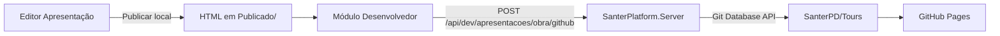

# SanterPD/Tours

Repositório **público** de hospedagem das apresentações de obra publicadas pela [Santer Plataforma](https://intranet.santerempreendimentos.com.br/plataforma/) — álbuns de fotos, plantas e **tours 360°** em um pacote web estático (HTML + imagens).

> **Este arquivo é a versão de referência mantida no monorepo SanterPlatform.**  
> Copie o conteúdo para `README.md` na raiz de [github.com/SanterPD/Tours](https://github.com/SanterPD/Tours).

---

## Para que serve

| Origem | Destino |
|--------|---------|
| Editor de Apresentação (por empreendimento) | HTML monolítico em `Apresentação/Publicado/` na intranet |
| Módulo **Desenvolvedor → Empreendimentos → GitHub** | Commit automático neste repositório |
| GitHub Pages | URL pública compartilhável com clientes e equipe |

O conteúdo editorial (manifest, fotos, hotspots 360°) é editado **somente na plataforma**. Este repositório é o espelho publicado para a web; alterações manuais aqui serão sobrescritas na próxima publicação.

---

## Estrutura no Git

Padrão configurado em `Apresentacao:GitHub` no servidor (`appsettings.json` / variáveis de ambiente):

| Configuração | Valor padrão |
|--------------|--------------|
| Owner | `SanterPD` |
| Repository | `Tours` |
| Branch | `main` |
| BasePath | `docs/apresentacoes` |

Cada obra vira uma pasta com **slug** derivado do nome da obra (minúsculas, sem acentos, espaços → hífen):

```
docs/
└── apresentacoes/
    └── residencial-fun/          ← slug da obra "RESIDENCIAL FUN"
        ├── index.html            ← apresentação (manifest embutido)
        └── assets/
            ├── img_0000.jpg
            ├── img_0001.webp
            └── ...
```

**Regra do slug:** apenas `a-z`, `0-9` e hífens (`SanearSlugObra` no backend). Ex.: `RESIDENCIAL FUN` → `residencial-fun`.

O HTML publicado na intranet é um arquivo único (imagens em `data:` URI). No envio ao GitHub, o servidor **extrai** as imagens para `assets/` e reescreve os `src` no `index.html`, para respeitar o limite de tamanho do GitHub e melhorar cache no navegador.

---

## URLs públicas (GitHub Pages)

Configure o repositório em **Settings → Pages**:

| Opção | Valor recomendado |
|-------|-------------------|
| Source | Deploy from a branch |
| Branch | `main` |
| Folder | `/docs` |

Com isso, o GitHub serve o conteúdo da pasta `docs/` na **raiz do site**, sem o prefixo `docs/` na URL.

| Caminho no Git | URL pública |
|----------------|-------------|
| `docs/apresentacoes/residencial-fun/index.html` | `https://santerpd.github.io/Tours/apresentacoes/residencial-fun/` |

A plataforma grava a URL retornada em `publicacao-meta.json` (campo `github.url`) após cada publicação bem-sucedida.

> **Nota:** Se a URL exibida no módulo Desenvolvedor incluir `/docs/` no caminho e a página não abrir, confira se o Pages está em `/docs` como acima. Em caso de layout diferente, ajuste `Apresentacao:GitHub:PagesUrlTemplate` no `appsettings` do servidor (placeholders `{owner}`, `{repo}`, `{path}`).

Opcional: arquivo vazio `docs/.nojekyll` evita que o Jekyll processe arquivos com `_` no nome.

---

## Fluxo de publicação (plataforma)



1. Na página **Apresentação** do empreendimento: gerar a publicação local (HTML em `Apresentação/Publicado/`).
2. No **Desenvolvedor → Empreendimentos**: botão **GitHub** na linha da obra (perfil desenvolvedor + token configurado no servidor).
3. O backend cria um commit com todos os arquivos da pasta da obra e atualiza a branch configurada.

Mensagem de commit típica: `Publicar apresentação {OBRA} (pacote web, N arquivos)`.

---

## Configuração no servidor (SanterPlatform)

Não commitar tokens neste repositório.

| Item | Onde configurar |
|------|-----------------|
| `Owner`, `Repository`, `Branch` | `.env` Docker: `APRESENTACAO_GITHUB_OWNER`, `APRESENTACAO_GITHUB_REPOSITORY`, `APRESENTACAO_GITHUB_BRANCH` |
| Token PAT | `APRESENTACAO_GITHUB_TOKEN` → `secrets/Apresentacao__GitHub__Token` (via `scripts/sync-docker-secrets`) |
| Demais opções | `SanterPlatform.Server/appsettings.json` → seção `Apresentacao:GitHub` |

**Escopos do PAT (classic):** `repo` (repositório privado) ou, em repositório público, token com permissão de escrita no conteúdo (`public_repo` / fine-grained **Contents: Read and write**).

O usuário ou app dono do token precisa ter permissão de **push** em `SanterPD/Tours`.

---

## Limites e boas práticas

| Limite | Valor |
|--------|--------|
| Tamanho máximo por arquivo (blob Git) | 100 MB |
| HTML monolítico na intranet | Sem limite prático além do disco; o GitHub exige o pacote dividido |

- Reduza resolução de panorâmicas 360° muito grandes antes de publicar online.
- Cada nova publicação da **mesma obra** substitui os arquivos da pasta `docs/apresentacoes/{slug}/` (novo commit; histórico preservado no Git).
- Repositório **vazio** na primeira publicação: suportado — o servidor cria o primeiro commit e a branch.

---

## O que não fazer neste repositório

- Não editar `index.html` ou `assets/` à mão para “corrigir” conteúdo — refaça na plataforma e publique de novo.
- Não versionar tokens, `.env` ou credenciais.
- Não mover pastas de obras sem alinhar o nome na plataforma (o slug é recalculado a partir do nome da obra).

Commits manuais (README, `.nojekyll`, workflows) são bem-vindos desde que não conflitem com as pastas sob `docs/apresentacoes/`.

---

## Solução de problemas

| Sintoma | Causa provável | Ação |
|---------|----------------|------|
| `GitHub (409): Git Repository is empty` | Primeiro push em repo vazio (versão antiga do servidor) | Atualizar SanterPlatform.Server e republicar |
| `GitHub não configurado` | Token ou Owner/Repository ausentes | Conferir secrets e `.env`; redeploy |
| `Nenhuma publicação local encontrada` | HTML não gerado na intranet | Publicar na página Apresentação antes do GitHub |
| Arquivo &gt; 100 MB | Imagem 360° ou álbum muito pesado | Comprimir imagens e republicar localmente |
| 403 no push | PAT sem escopo ou sem acesso ao repo | Recriar token com escrita em conteúdo |
| Página 404 na URL | GitHub Pages não configurado ou pasta `/docs` incorreta | Ajustar Settings → Pages (ver acima) |

Logs do servidor: busca por `Pacote web GitHub` ou `GitHub API` em `ApresentacaoGithubPublishService`.

---

## Repositório relacionado

- **SanterPlatform** — aplicação interna (editor, publicação local, orquestração do push).
- **Este repositório** — apenas artefatos estáticos publicados para GitHub Pages.

Dúvidas de operação: equipe de P&D / módulo Desenvolvedor na intranet.
